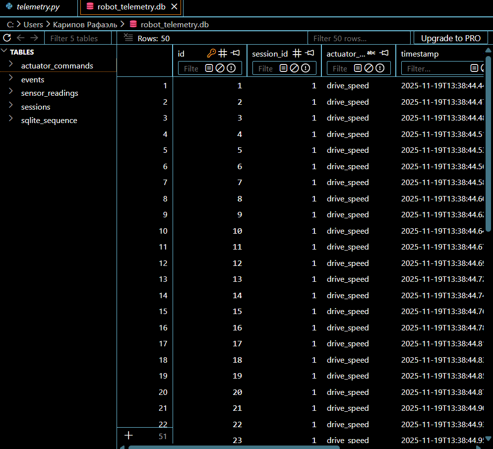
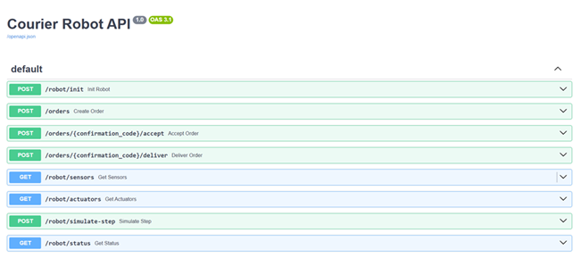
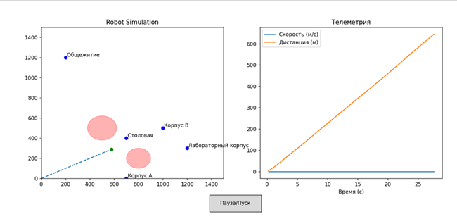
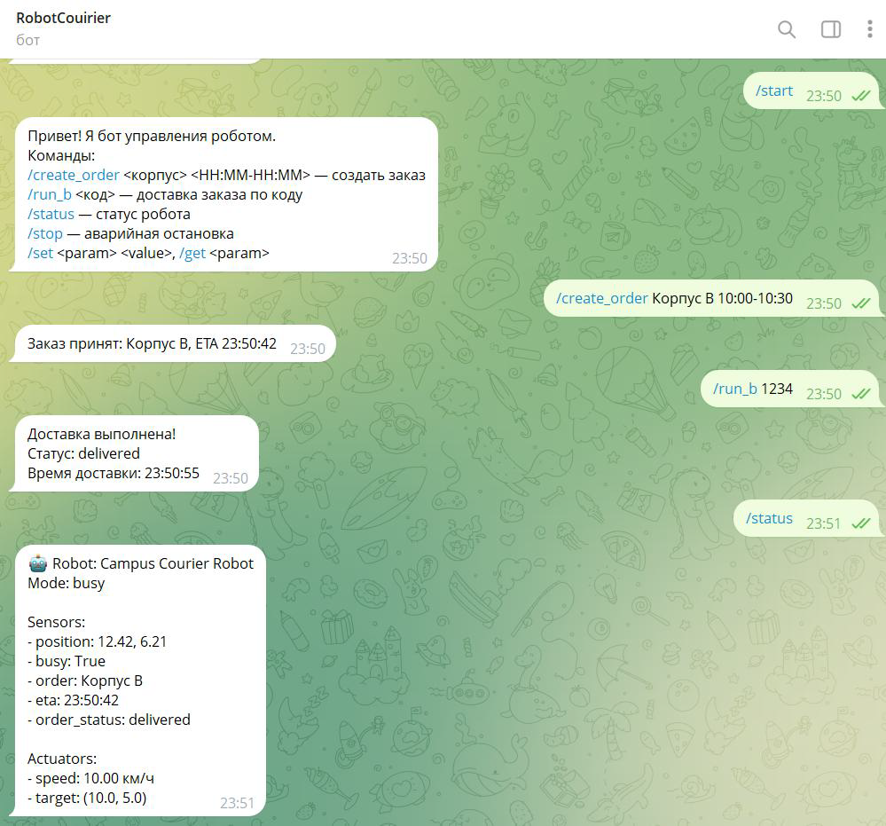

# 🤖 Delivery Robot System

Комплексный учебный проект по разработке программной архитектуры **робота-доставщика**  
с использованием современных инструментов **робототехники, backend-разработки и компьютерного зрения**.

Система моделирует работу автономного курьерского робота и включает модули управления,  
мониторинга, анализа данных и взаимодействия с пользователем.

---

## 🚀 Реализованные подсистемы

### 🧠 Управление роботом
- Объектно-ориентированная модель робота
- Логика движения и принятия решений
- Симуляция поведения в виртуальной среде

---

### 📡 Телеметрия и данные
- Сбор телеметрии во время работы робота
- Логирование данных в **SQLite** базу данных
- Сохранение:
  - показаний сенсоров
  - команд приводам
  - событий и ошибок

---

### ⚡ Кэширование
- Реализовано локальное кэширование данных робота
- Снижение нагрузки на БД
- Ускорение доступа к состоянию системы

---

### 🌐 FastAPI сервис
- REST API для взаимодействия с системой робота
- Получение текущего состояния робота
- Доступ к телеметрии и данным симуляции

---

### 🧪 Тестирование
- Модульные тесты с использованием `unittest`
- Проверка:
  - логики управления
  - обработки данных
  - сервисных компонентов

---

### 📊 Визуализация и симуляция
- Графическая симуляция движения робота
- Отображение:
  - параметров движения
  - состояния системы
  - телеметрии на графиках

---

### 👁 Компьютерное зрение (YOLO)
- Подсистема зрения робота на базе **YOLOv8**
- Обнаружение объектов на изображении
- Принятие решений:
  - движение
  - остановка  
  на основе анализа сцены

---

### 🤖 Telegram-бот
- Интерфейс управления роботом через Telegram
- Получение:
  - текущего статуса
  - уведомлений от системы

---

### 🔧 Интеграция с ROS2
- Архитектурная совместимость с экосистемой **ROS2**
- Подготовка к работе в распределённой робототехнической среде

---

## 🏗 Архитектурный подход

Проект построен по принципам:
- **OOP** — разделение системы на независимые компоненты
- **SRP (Single Responsibility Principle)**
- Модульность и расширяемость
- Чёткое разделение подсистем:
  - управление
  - восприятие
  - данные
  - API
  - пользовательские интерфейсы

---

## 🎯 Результат

Разработана масштабируемая программная модель курьерского робота, объединяющая:
- управление движением
- компьютерное зрение
- хранение и обработку телеметрии
- API и пользовательские интерфейсы
- инструменты тестирования и симуляции

Проект демонстрирует **комплексный подход** к разработке интеллектуальных  
робототехнических систем.
